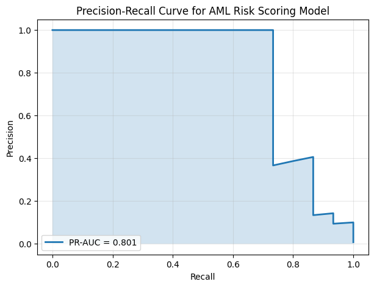
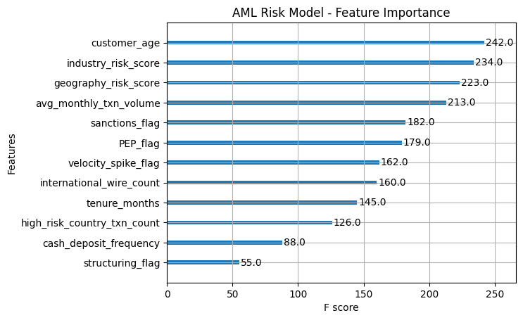
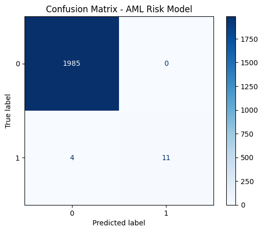

# 🚨 AML Risk Scoring & Alert Prioritization System

---

## 📌 Project Overview

This project builds an end-to-end **Anti-Money Laundering (AML) Risk Scoring System** using machine learning to detect and prioritize suspicious financial activity (SAR risk).

The system is designed to reduce false positives in transaction monitoring systems while improving the prioritization of high-risk alerts for financial crime investigations.

---

## 🎯 Business Problem

Financial institutions generate large volumes of AML alerts, most of which are false positives. This leads to:

- Operational inefficiency  
- Delayed investigations  
- Increased compliance workload  

This project addresses these challenges using machine learning-based **risk scoring and alert prioritization**.

---

## 🎯 Objective

To build a machine learning model that predicts the probability of suspicious activity (SAR risk) using:

- Customer attributes  
- Regulatory risk indicators  
- Transaction behavioral features  

---

## 🧠 Solution Approach

- Synthetic AML dataset creation with realistic fraud typologies  
- Feature engineering (behavioral + regulatory risk signals)  
- XGBoost classification model for SAR prediction  
- Handling extreme class imbalance (~<1% SAR rate)  
- Probability-based risk scoring system  
- Threshold tuning for optimal classification performance  
- SHAP explainability for model transparency  

---

## 🧪 Model Architecture

- Algorithm: **XGBoost Classifier**
- Output: SAR probability (risk score)
- Optimization: F1-based threshold tuning
- Evaluation Metric: Precision-Recall AUC

---

## 📊 Model Performance

- **PR-AUC: 0.801**
- Strong performance on highly imbalanced dataset
- Effective ranking of high-risk alerts
- Improved precision in top-risk cases

---

## 📈 Visualizations

### 🔹 Precision-Recall Curve

### 🔹 Feature Importance

### 🔹 Confusion Matrix

---

## 🔍 Explainability (SHAP)

SHAP (SHapley Additive exPlanations) was used to:

- Explain global feature importance  
- Interpret individual alert-level predictions  
- Support transparency for AML compliance use cases  

---

## 🚨 Business Impact

This system can be used in real-world AML environments to:

- Reduce false positive alerts  
- Prioritize high-risk investigations  
- Improve analyst efficiency  
- Support regulatory audit requirements  
- Enable explainable AI decision-making  

---

## 🧠 Key Features Used

- Customer demographics  
- PEP & sanctions flags  
- Geographic & industry risk scores  
- Transaction behavior patterns  
- Structuring indicators  
- Velocity spike detection  

---

## 🛠️ Tech Stack

- Python  
- Pandas / NumPy  
- Scikit-learn  
- XGBoost  
- SHAP  
- Matplotlib  

---

## 📂 Project Structure
